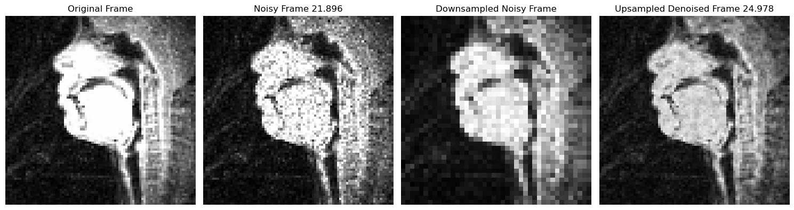

# Research Project FAU WiSe 2024/25
### Phoneme detection from MRI frames

Research/Academic Project repo. Here is an overview of the project structure and a brief description of each folder.

## Folder Structure

- **/examples**: Code minimal-examples to use the scripts inside the source folder.
- **/images**: Some outputs from the implementations.
- **/literature**: Scientific literature taken as reference.
- **/src**: Scripts for data processing, analysis and visualizations.

- **/data**: Should contain the datasets used in the research project. For simplicity the files are not here but are fetched from [USC 75-Speaker Speech MRI Database](https://sail.usc.edu/span/75speakers/#:~:text=This%20dataset%20offers%20a%20unique,domain%20raw%20RT%2DMRI%20data).

Here is an example image from the project when using image fusion/upsampling to explore its denoising properties:

And here a complete comparison between the methods tested so far, with three image quality metrics:

Also, when noise is added:

___
Author: Julián Hernández Potes (julian.hernandez.potes@fau.de)

Tutor: Tomás Arias Vergara (tomas.arias@fau.de)
